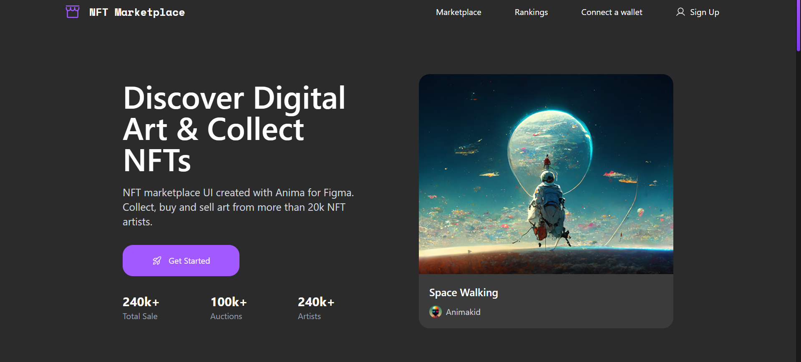
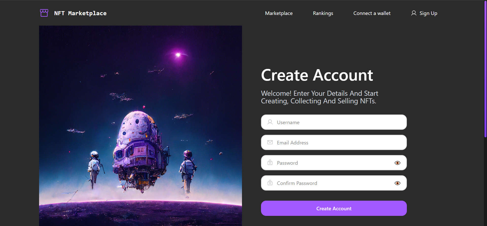

# 🎨 NFT Marketplace

<p align="center">
  
  
</p>

A modern, responsive NFT Marketplace frontend built with **HTML, Tailwind CSS, JavaScript (ES6+), jQuery, Axios, and JSON Server**. This project delivers a clean UI, responsive design, and interactive user experience.

---

## ✨ Features

- 📱 **Fully Responsive**
  - Optimized for Mobile, Tablet, and Desktop devices.

- 🖼️ **NFT Showcase**
  - Display NFT collections, trending items, and creators.

- ⚡ **Modern Frontend**
  - Developed using ES6+ JavaScript and Tailwind CSS.

- 🧩 **Interactive UI**
  - Smooth navigation, animations, back-to-top button, and user-friendly interactions.

- 🛡️ **Form Validation**
  - Client-side validation powered by jQuery.

- 🌐 **API Integration**
  - Axios for HTTP requests and JSON Server as a mock backend.

---

## 🚀 Live Demo

### 🌍 Visit the Live Website

👉 **https://ehsanellahi1385-commits.github.io/NFT-marketplace/**

Or click here:

**[Open NFT Marketplace](https://ehsanellahi1385-commits.github.io/NFT-marketplace/)**

---

## 🛠️ Tech Stack

- HTML5
- Tailwind CSS
- JavaScript (ES6+)
- jQuery
- Axios
- JSON Server

---

# 📥 Installation

## Clone the Repository

```bash
git clone https://github.com/ehsanellahi1385-commits/NFT-marketplace.git
cd NFT-marketplace
```

## Install Dependencies

```bash
npm install
```

## Run the Project

Open four terminal tabs and run:

```bash
npm run start:tw
```

```bash
npm run start:tw-2
```

```bash
npm run start:api-user
```

```bash
npm run dev
```

---

## 📂 Project Structure

```text
NFT-Marketplace/
├── assets/
├── css/
├── js/
├── index.html
├── logIn.html
└── README.md
```

---

## 📄 License

This project is intended for educational and portfolio purposes.

---

## ⭐ Support

If you like this project, please consider giving it a ⭐ on GitHub.

---

## 👨‍💻 Author

**Ehsan Ellahi**

GitHub: https://github.com/ehsanellahi1385-commits
